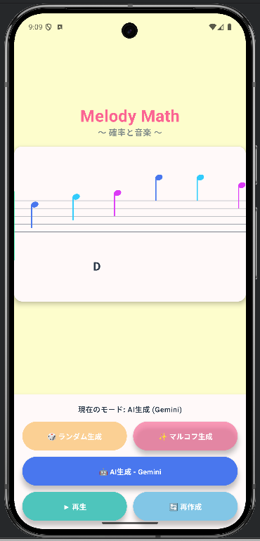

# 🎵 Melody Math - 確率と音楽 -

[](https://kotlinlang.org)
[](https://www.jetbrains.com/lp/compose-multiplatform/)
[](https://ai.google.dev/)
[](https://ktor.io/)
[](/)
[](LICENSE)

> *2005年の卒業研究が、20年の時を超えて Kotlin Multiplatform × Gemini AI で蘇る*

<p align="center">
  
</p>

---

## 📖 このプロジェクトについて

**Melody Math** は、「**確率**」と「**音楽**」の関係を体験できる**中学3年生向け**の教育アプリです。

3つの生成モードで作られるメロディを**聴き比べる**ことで、確率分布・マルコフ連鎖・生成AIの違いを直感的に理解できます。

---

## 🕰️ 20年の時を超えたリバイバル

| | 2005年（卒業研究） | 2025–2026年（リバイバル） |
|:---|:---|:---|
| **言語** | Excel VBA | Kotlin 2.2.20 |
| **UI** | Flash (SWF) | Jetpack Compose Multiplatform |
| **プラットフォーム** | Windows PC (ブラウザ) | Android & iOS |
| **AI** | — | Google Gemini 2.5 Flash |
| **生成モード** | ランダム / マルコフ連鎖 | ランダム / マルコフ連鎖 / **AI** |

2005年、開発者が大学の卒業研究として「**確率（マルコフ連鎖）を音楽で体感する**」教材を Excel VBA と Flash で作りました。

それから20年——。2025年に Kotlin Multiplatform で再構築し、2026年には **Gemini 2.5 Flash** による AI 生成モードを追加。3段階モデルフォールバック・段階的バックオフリトライ・安全設定最適化を備えた、プロダクション品質の AI 統合を実現しました。

当時は2つだった生成モードに「**AI（知能）**」が加わり、「ランダム → 確率 → 知能」という段階的な比較体験が完成しています。

---

## ✨ 3つの生成モード

| モード | 🎲 ランダム生成 | ✨ マルコフ連鎖 | 🤖 AI 生成 (Gemini) |
|:---:|:---:|:---:|:---:|
| **アルゴリズム** | 一様乱数 | 確率行列 | ニューラルネットワーク |
| **結果** | カオス・不協和音 | 美しい調和 | 文脈を理解した作曲 |
| **特徴** | 完全ランダム | 2005年のロジックを再現 | 楽曲全体の構成を考慮 |
| **技術** | `kotlin.random.Random` | 重み付き遷移確率 | Gemini 2.5 Flash + JSON Mode |
| **堅牢性** | — | — | 3モデルフォールバック + リトライ |

### 🎲 Mode A: ランダム生成 (Chaos)

完全にランダムな音を生成。音楽理論を無視した「カオス」がどう聴こえるかを体験します。
→ **結論：ランダムだけでは音楽にならない！**

### ✨ Mode B: マルコフ連鎖 (Probability)

パッヘルベルのカノン進行 `D → A → Bm → F#m → G → D → G → A` に基づく遷移行列を使用。各コードに対する「次の音の確率」が定義されており、確率の力で「それっぽい」メロディが生まれます。

### 🤖 Mode C: AI 生成 (Intelligence)

Google Gemini 2.5 Flash を使用（2.0 / 1.5 への自動フォールバック付き）。プロンプトで楽曲のコンテキスト（コード進行・音域・拍数）を伝え、JSON Mode で構造化されたメロディデータを取得します。
→ **「確率」を超えた「知能」による作曲を体験！**

---

## 🛠️ 技術スタック

### Core

| カテゴリ | 技術 | バージョン |
|:---|:---|:---:|
| **言語** | Kotlin (Kotlin Multiplatform) | 2.2.20 |
| **UI** | Jetpack Compose Multiplatform | 1.9.1 |
| **楽譜描画** | Canvas API によるカスタム五線譜・音符レンダリング | — |
| **AI** | Google Gemini 2.5 Flash（`v1beta` エンドポイント） | — |
| **HTTP** | Ktor Client | 3.0.3 |
| **JSON** | kotlinx.serialization | 1.7.3 |

### AI モデル戦略: 3段階フォールバック

```
┌─────────────────────────────────────────────────────┐
│  gemini-2.5-flash   (プライマリ: 最新・最速)          │
│        │ 失敗時 → 最大3回リトライ (2s→4s→6s)         │
│        ↓ 2秒待機                                     │
│  gemini-2.0-flash   (セカンダリ: フォールバック)       │
│        │ 失敗時 → 最大3回リトライ (2s→4s→6s)         │
│        ↓ 2秒待機                                     │
│  gemini-1.5-flash   (安定版: 最も広く利用可能)         │
│        │ 失敗時 → 最大3回リトライ (2s→4s→6s)         │
└─────────────────────────────────────────────────────┘
   合計: 最大 3モデル × 3リトライ = 9回の試行で回復を図る
```

| 項目 | 詳細 |
|:---|:---|
| **プライマリモデル** | `gemini-2.5-flash` — 最新の推論能力を優先 |
| **セカンダリモデル** | `gemini-2.0-flash` — プライマリ不可時のフォールバック |
| **安定版モデル** | `gemini-1.5-flash` — 最も広く利用可能な最終手段 |
| **リトライ回数** | 各モデルにつき最大 **3回** |
| **モデル切り替え間隔** | **2秒**の待機で 429 レートリミットを予防 |
| **最大試行数** | **9回**（3モデル × 3リトライ） |

### オーディオ

| プラットフォーム | 実装 |
|:---:|:---|
| **Android** | `AudioTrack` API による波形合成 |
| **iOS** | `AVFoundation` / `AVAudioEngine` (Kotlin/Native interop) |

---

## 🛡️ 堅牢性 (Robustness)

教育現場での安定動作を重視し、AI API 呼び出しに多層的な堅牢性設計を実装しています。

### タイムアウト設計

| パラメータ | 値 | コード上の定数 | 用途 |
|:---|:---:|:---|:---|
| リクエストタイムアウト | **10分** | `REQUEST_TIMEOUT_MS = 600_000L` | AI の長時間推論に対応 |
| ソケットタイムアウト | **10分** | `SOCKET_TIMEOUT_MS = 600_000L` | ストリーミング応答の途切れ防止 |
| 接続タイムアウト | **30秒** | `CONNECT_TIMEOUT_MS = 30_000L` | サーバー到達不能の早期検出 |

### リトライ戦略: 段階的バックオフ

各モデルに対して最大 **3回**のリトライを独立に実行し、バックオフ時間は `基準値 × (試行回数)` で段階的にスケーリングします。

| エラー種別 | 基準値 | 1回目 | 2回目 | 3回目 | 計算式 |
|:---|:---:|:---:|:---:|:---:|:---|
| **一般エラー** | 2秒 | 2秒 | 4秒 | 6秒 | `RETRY_DELAY_MS × (attempt + 1)` |
| **429 レートリミット** | 5秒 | 5秒 | 10秒 | 15秒 | `RATE_LIMIT_DELAY_MS × (attempt + 1)` |
| **モデル切り替え** | 2秒 | — | — | — | フォールバック間の固定ディレイ |

### 3段階エラーチェック

```
リクエスト送信
    │
    ├─① promptFeedback.blockReason → プロンプトがブロックされた？
    │   └─ Yes → 安全フィルターの事前ブロックを検出・報告
    │
    ├─② finishReason: SAFETY → 生成後にブロックされた？
    │   └─ Yes → 該当カテゴリを特定して報告
    │
    └─③ 応答テキストが空？
        └─ Yes → フォールバック処理 + 詳細エラー報告
```

### HTTP ステータス別処理

| ステータス | 動作 | リトライ |
|:---:|:---|:---:|
| **429** | レートリミット — 段階的バックオフでリトライ | ✅ |
| **500/503** | サーバーエラー — バックオフでリトライ | ✅ |
| **400** | Bad Request — リトライせず即座にエラー報告 | ❌ |
| **403** | APIキー無効 — 設定確認を促すメッセージ表示 | ❌ |
| **404** | モデル未対応 — 次のフォールバックモデルへ | ➡️ |

---

## 🎼 Safety Settings の最適化

Gemini API の安全フィルターは、音楽コード進行の記述（例：`D → A → Bm`）を**誤検知でブロック**することがあります。

本アプリでは音楽生成という用途の特性上、全4カテゴリの安全設定を `BLOCK_NONE` に設定しています：

| カテゴリ | 設定 | 理由 |
|:---|:---:|:---|
| HARM_CATEGORY_HARASSMENT | `BLOCK_NONE` | 音楽用語の誤検知を防止 |
| HARM_CATEGORY_HATE_SPEECH | `BLOCK_NONE` | コード進行表記の誤検知を防止 |
| HARM_CATEGORY_SEXUALLY_EXPLICIT | `BLOCK_NONE` | 音楽生成に関係のないブロックを防止 |
| HARM_CATEGORY_DANGEROUS_CONTENT | `BLOCK_NONE` | 楽曲構造データの誤検知を防止 |

> 💡 これにより、AI が音楽理論に基づいた自由なメロディ生成を行えるようになります。

---

## 🔒 セキュリティ設計 — API キーを守る3つの防壁

本プロジェクトでは、API キーの安全な管理を**後付けの対策ではなく、設計上の基本原則**として組み込んでいます。開発者のプライバシーを守るために、ソースコード・ログ・UI のすべてのレイヤーでキーが露出しない仕組みを構築しました。

### 防壁 1: ソースコードからの完全分離

API キーはソースコードに一切埋め込まず、プラットフォーム固有の設定ファイルで管理します。いずれも `.gitignore` に登録済みで、リポジトリにコミットされることはありません。

```
┌──────────────────────────────────────────────────────────────────┐
│                    local.properties                              │
│                  GEMINI_API_KEY=AIza...                           │
│                    (.gitignore 済み)                              │
│                         │                                        │
│          ┌──────────────┴──────────────┐                         │
│          ↓                             ↓                         │
│   [Android ビルド]                [iOS ビルド]                    │
│   BuildConfig.GEMINI_API_KEY      Config.xcconfig → Info.plist   │
│   (コンパイル時に埋め込み)        (Gradle タスクで自動同期)       │
└──────────────────────────────────────────────────────────────────┘
```

| プラットフォーム | キーの流れ |
|:---|:---|
| **Android** | `local.properties` → Gradle `buildConfigField` → `BuildConfig.GEMINI_API_KEY` |
| **iOS** | `local.properties` → `updateIosGeminiApiKey` タスク → `Config.xcconfig` → `Info.plist` → `NSBundle` |

### 防壁 2: ログ出力でのマスク処理

`GeminiApiClient` 内の `maskApiKey()` 関数が、すべてのログ出力に対してキーを自動マスクします。

```kotlin
// 実際のコードから抜粋（GeminiApiClient.kt）
private fun maskApiKey(message: String): String {
    if (apiKey.isEmpty()) return message
    return message
        .replace(apiKey, "***")                            // 完全一致
        .replace(Regex("[?&]key=[^&\\s)\"']+"), "?key=***") // URLパラメータ
        .replace(Regex("AIza[A-Za-z0-9_-]{30,}"), "***")  // Google APIキーパターン
}
```

| マスク対象 | 検出パターン | 置換結果 |
|:---|:---|:---|
| APIキー完全一致 | リテラル文字列 | `***` |
| URL パラメータ | `key=[^&]+` | `key=***` |
| Google API キーパターン | `AIza[A-Za-z0-9_-]{30,}` | `***` |

初期化時のログでは先頭4文字のみ表示（例：`AIza****`）し、フルキーは一切出力しません。

### 防壁 3: UI 表示でのサニタイズ

エラーメッセージがユーザーに表示される前に、`sanitizeError()` 関数が同じマスクロジックを適用します。

> 🛡️ **設計思想**: これら3つの防壁は、「うっかりキーが漏れる」事故を構造的に不可能にするための**多層防御**です。単一のレイヤーが突破されても、残りのレイヤーがキーを保護します。

---

## 🏗️ アーキテクチャ

```
composeApp/
├── src/
│   ├── commonMain/kotlin/com/example/markovmusic/
│   │   ├── App.kt                    # Compose UI エントリーポイント
│   │   ├── model/                    # データモデル (Note, Pitch, Chord, Score)
│   │   ├── generator/                # 生成ロジック
│   │   │   ├── RandomGenerator.kt    # 一様乱数
│   │   │   ├── MarkovChainGenerator.kt # 確率行列遷移
│   │   │   └── GeminiMelodyGenerator.kt # AI 生成
│   │   ├── network/                  # GeminiApiClient (3段階フォールバック + リトライ)
│   │   ├── audio/                    # ToneSynthesizer (expect 宣言)
│   │   └── ui/                       # StaffNotation, PlaybackController 等
│   ├── androidMain/                  # actual 実装 (AudioTrack, BuildConfig)
│   └── iosMain/                      # actual 実装 (AVAudioEngine, Info.plist)
```

### expect/actual パターン

| インターフェース | Android | iOS |
|:---|:---|:---|
| `ToneSynthesizer` | `AudioTrack` | `AVAudioEngine` |
| `getGeminiApiKey()` | `BuildConfig` | `NSBundle` / `Info.plist` |
| `TextRenderer` | Canvas テキスト計測 | プラットフォーム固有実装 |

---

## 💻 生徒・学習者向け：自分の PC で動かす 3 ステップ

このアプリは、自分の PC でプログラムを動かして、中身を書き換えて遊ぶことができます。

### 1. 道具（ツール）を準備する
* **Android Studio** をインストールします（[公式サイト](https://developer.android.com/studio)）。
* このプロジェクトをダウンロード（または `git clone`）して、Android Studio で開きます。

### 2. AI の「カギ」を手に入れる
AI モードを動かすには、Google の AI サービスを使うための「カギ」が必要です。
1.  **[Google AI Studio](https://aistudio.google.com/)** にアクセスします。
2.  `Create API key` ボタンを押して、自分専用のキーを発行し、コピーします。

### 3. 設定して動かす！
1.  プロジェクトのフォルダにある **`local.properties`** というファイルを開きます。
2.  一番下の行に `GEMINI_API_KEY=あなたのコピーしたキー` と書き込んで保存します。
3.  Android Studio の右上にある **再生ボタン（Run）** を押すと、アプリが起動します！

> 💡 **やってみよう！**: アプリが動いたら、プログラムの中の数字やメッセージを書き換えて、メロディがどう変わるか実験してみましょう。

---

## 🚀 Getting Started

### 必要なもの

- Android Studio Ladybug 以降（推奨）
- Xcode 15+（iOS ビルド用）
- [Google AI Studio](https://aistudio.google.com/) アカウント（Gemini API Key 取得用）

### セットアップ手順

#### 1. リポジトリをクローン

```bash
git clone https://github.com/your-username/MarkovMusic.git
cd MarkovMusic
```

#### 2. Gemini API Key を取得

1. [Google AI Studio](https://aistudio.google.com/) にアクセス
2. API Key を作成（Gemini 2.5 Flash 対応キー）

#### 3. API Key を安全に設定

**Android** — `local.properties`（プロジェクトルート）:

```properties
# local.properties（.gitignore 済み — リポジトリにコミットされません）
GEMINI_API_KEY=your_api_key_here
```

> ビルド時に `BuildConfig.GEMINI_API_KEY` として自動的に埋め込まれます。

**iOS** — `Config.xcconfig`:

```bash
# テンプレートから設定ファイルを作成
cp iosApp/Configuration/Config.xcconfig.template iosApp/Configuration/Config.xcconfig

# local.properties の値を自動反映
./gradlew updateIosGeminiApiKey
```

> ビルド時に `Info.plist` 経由でアプリに渡されます。

#### 4. ビルド & 実行

**Android:**

```bash
./gradlew :composeApp:assembleDebug
```

または Android Studio から直接実行。

**iOS:**

1. Xcode で `iosApp/iosApp.xcodeproj` を開く
2. シミュレータまたは実機で実行

---

## 📚 教育的な使い方

### 対象

**中学3年生**（数学：確率、技術：情報の技術）

### 授業での活用例

| ステップ | 内容 | 学習目標 |
|:---:|:---|:---|
| **1. 導入** | 3つのモードを順番に試し、音の違いを聴き比べる | 「ランダム」と「パターン」の違いに気づく |
| **2. 考察** | なぜマルコフ連鎖の方が音楽っぽいのか議論 | 条件付き確率の直感的理解 |
| **3. 発展** | AI 生成との違いから「知能とは何か」を考える | 生成 AI の仕組みへの興味喚起 |

### 学習ポイント

- **確率分布**と**条件付き確率**の直感的理解
- **マルコフ性**（現在の状態のみが次を決める）の体験
- **ランダム → 確率 → 知能**という段階的な理解
- **生成 AI** の仕組みへの興味喚起

---

## ⚖️ 商標

Android、Google、Gemini、Material Design は Google LLC の商標です。
iPhone、Apple、iOS、Xcode は Apple Inc. の商標です。
Kotlin、Compose Multiplatform は JetBrains s.r.o. の商標です。
Gradle は Gradle Inc. の商標です。
その他、記載されている会社名、製品名は各社の商標または登録商標です。
本プロジェクトはこれらの企業とは一切関係がなく、公式に承認・提携されたものではありません。

---

## 📄 License

This project is licensed under the MIT License - see the [LICENSE](LICENSE) file for details.

---

## 🙏 Acknowledgments

- **パッヘルベルのカノン** — 300年以上愛され続ける名曲のコード進行を教材として使用
- **2005年の卒業研究** — 20年前の Excel VBA + Flash のアイデアを現代に蘇らせました
- **Google Gemini 2.5 Flash** — 最新の生成 AI による音楽作曲を実現

---

<p align="center">
  <strong>🎵 確率の美しさを、音楽で体感しよう 🎵</strong><br>
  <sub>From 2005 Thesis to 2026 AI — Powered by Gemini 2.5 Flash</sub>
</p>